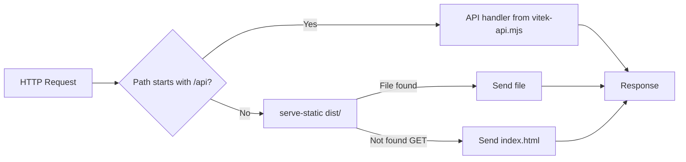

# Production server (vitek-serve)

After `vite build`, use **vitek-serve** to run your app (static assets + API) in production or locally in a production-like way.

## When to use

- You have run `vite build` and have a `dist/` folder (and optionally `dist/vitek-api.mjs`).
- You want one process that serves both the frontend and the API at `/api/*`.
- You are deploying to a Node host or running locally to test the production build.

## How it works

vitek-serve is a small Node server that:

1. **API first:** If `dist/vitek-api.mjs` exists, it loads the bundle and mounts the API handler at `/api`. Requests to `/api/*` are handled by the same logic as in development.
2. **Static files:** Serves files from `dist/` (e.g. `index.html`, `assets/*.js`, `assets/*.css`).
3. **SPA fallback:** For GET requests that are not under `/api` and do not match a file, it serves `dist/index.html` so client-side routing works.

Request flow:



## Usage

From your project root (where `dist/` exists), run the `vitek-serve` binary (provided by the installed `vitek-plugin`). Add a script to your `package.json`:

```json
{
  "scripts": {
    "start": "vitek-serve"
  }
}
```

Then run:

```bash
pnpm start
# or
npm start
```

The server listens at `http://localhost:3000` by default.

## Environment variables

If you do not pass `--port` or `--host`, vitek-serve uses `process.env.PORT` and `process.env.HOST` when set (e.g. on Heroku, Railway). CLI flags override env.

```bash
PORT=8080 HOST=0.0.0.0 pnpm start
```

## Options

| Option           | Default   | Description                                                                 |
| ---------------- | --------- | --------------------------------------------------------------------------- |
| `--dir`          | `dist`    | Directory to serve (relative to current directory)                          |
| `--port`         | `3000`    | Port to listen on                                                           |
| `--host`         | `0.0.0.0` | Host to bind to                                                             |
| `--cors`         | off       | Enable CORS (permissive `*` origin) for the API                             |
| `--trust-proxy`  | off       | Trust `X-Forwarded-*` headers (use when behind nginx, Caddy, or similar)     |

Examples:

```bash
vitek-serve --port 8080
vitek-serve --dir=dist --port 3000 --host 127.0.0.1
vitek-serve --trust-proxy   # when behind a reverse proxy (correct client IP and URL)
vitek-serve --cors          # enable CORS for the API
```

## Production config (vitek.config.mjs)

To run **beforeApiRequest** or **onError** hooks in production, add a config file that vitek-serve will load from the output directory:

- **Path:** `dist/vitek.config.mjs` (or `dist/vitek.config.js`). The file must be in the same directory you pass to `--dir` (default `dist`).
- **Exports:** `beforeApiRequest` (single function or array of functions) and/or `onError` (function). Same signatures as in the plugin options.

Example `vitek.config.mjs` in your project root, and ensure it is **copied to `dist/`** during build (e.g. via Vite’s `publicDir` or a copy step):

```javascript
// dist/vitek.config.mjs (or build so this file ends up in dist/)
export function beforeApiRequest(ctx, next) {
  // e.g. auth, logging
  next();
}

export function onError(err, req, res) {
  res.statusCode = 503;
  res.setHeader('Content-Type', 'application/json');
  res.end(JSON.stringify({ error: 'Service Unavailable' }));
}
```

If the file is missing or fails to load, vitek-serve continues without these hooks and logs a warning.

## When the API is not available

If `dist/vitek-api.mjs` is missing (e.g. you set `buildApi: false` or have no API routes), vitek-serve still starts and serves only static files and the SPA fallback. You will see a one-line log: `[vitek-serve] No API bundle found; serving static files only.`

## Relation to vite preview

`vite preview` is Vite's built-in way to preview the static build locally. It is **not** the recommended way to serve the app with the API in production. For production (or local production-like runs with the API), use **vitek-serve**.

## Next steps

To run vitek-serve behind a reverse proxy (nginx, Caddy), with a process manager (PM2), or in Docker, see [Deployment & integrations](./production-deploy).
